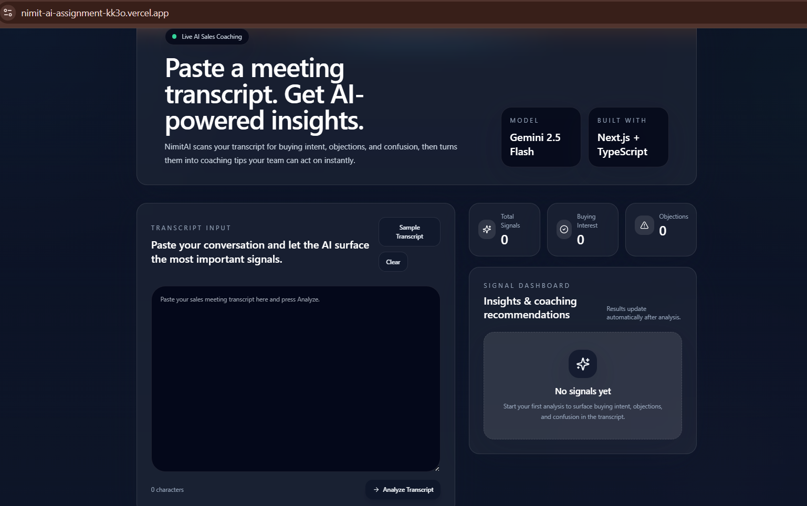

# NimitAI Sales Signal Analyzer
## Preview


# NimitAI Sales Signal Analyzer

An AI-powered sales conversation analyzer that identifies buying intent, objections, and confusion signals from meeting transcripts and generates actionable coaching recommendations using Gemini 2.5 Flash.

## Preview


## Live Demo

🔗 Add your Vercel deployment link here

## GitHub Repository

🔗 Add your GitHub repository link here

---

## Problem Statement

Sales teams often spend significant time manually reviewing meeting transcripts to identify buying intent, customer objections, and confusion signals.

NimitAI automates this process using Gemini AI, helping sales representatives quickly uncover actionable insights and coaching opportunities.

---

## Features

* AI-powered sales signal extraction
* Buying interest detection
* Objection identification
* Customer confusion detection
* Actionable coaching recommendations
* Secure backend API integration
* Structured JSON-based AI responses
* Responsive SaaS-style dashboard
* Real-time transcript analysis
* Modern UI with smooth user experience

---

## Application Flow

1. User pastes a sales conversation transcript.
2. Frontend sends the transcript to the `/api/analyse` API route.
3. Backend securely communicates with Gemini 2.5 Flash.
4. Gemini analyzes the transcript and extracts sales signals.
5. Structured JSON data is returned to the frontend.
6. Insights and coaching recommendations are displayed in the dashboard.

### Architecture

```text
User Transcript
       │
       ▼
Next.js Frontend
       │
       ▼
POST /api/analyse
       │
       ▼
Gemini 2.5 Flash
       │
       ▼
Structured JSON Response
       │
       ▼
Signal Dashboard
```

---

## Example Analysis

### Input

```text
Rep: What would be the most important metric for your buying decision?

Customer: We need clear time-to-value and how this reduces churn. If the onboarding support is strong, we're likely to move forward.
```

### Output

```json
{
  "signals": [
    {
      "type": "buying_interest",
      "quote": "If the onboarding support is strong, we're likely to move forward.",
      "tip": "Provide onboarding success examples and discuss implementation support."
    }
  ]
}
```

---

## Tech Stack

| Technology       | Purpose            |
| ---------------- | ------------------ |
| Next.js 15       | Frontend & Backend |
| TypeScript       | Type Safety        |
| Tailwind CSS     | Styling            |
| Gemini 2.5 Flash | AI Analysis        |
| Framer Motion    | UI Animations      |
| Vercel           | Deployment         |

---

## Project Structure

```text
app/
├── api/
│   └── analyse/
│       └── route.ts

components/
├── SalesAnalyzer.tsx
├── SignalCard.tsx
├── AnalyticsCard.tsx

lib/
types/
public/
```

---

## Getting Started

### 1. Install Dependencies

```bash
npm install
```

### 2. Configure Environment Variables

Create a `.env` file:

```env
GEMINI_API_KEY=your_gemini_api_key_here
```

### 3. Run Development Server

```bash
npm run dev
```

Open:

```text
http://localhost:3000
```

---

## API Endpoint

### POST /api/analyse

Analyzes sales transcripts and returns structured insights.

#### Request

```json
{
  "transcript": "Customer conversation text..."
}
```

#### Response

```json
{
  "signals": [
    {
      "type": "buying_interest",
      "quote": "Send me the pricing deck.",
      "tip": "Ask about purchasing timeline."
    }
  ]
}
```

---

## Challenges Faced

* Ensuring Gemini consistently returns valid JSON
* Handling malformed AI responses safely
* Designing a clean and intuitive dashboard
* Securing API keys using server-side routes
* Deploying AI-powered applications on Vercel

---

## Future Improvements

* Audio file upload support
* Real-time meeting analysis
* CRM integration (HubSpot, Salesforce)
* Downloadable PDF reports
* Sentiment analysis
* Team analytics dashboard
* Multi-language transcript support

---

## Security

* API keys are stored securely using environment variables.
* Sensitive credentials are never exposed to the client.
* AI requests are processed through secure backend routes.

---

## Deployment

### Build

```bash
npm run build
```

### Start Production Server

```bash
npm run start
```

---

## Author

**Himanshu Verma**

Built as part of the NimitAI AI Engineering Internship Assignment.

---

## License

This project is intended for educational and internship assessment purposes.
